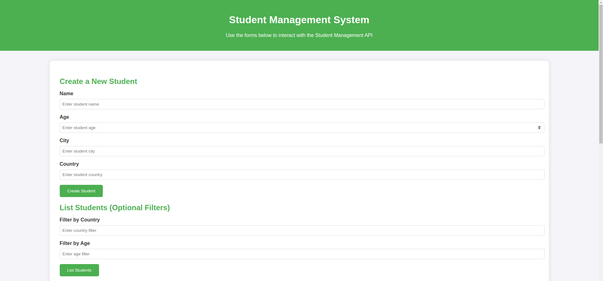

# Library Management System
[](https://huggingface.co/spaces/Umair98392/lms)

## Overview

This project implements a Library Management System using FastAPI for building RESTful APIs and MongoDB Atlas as the database. The system provides a set of APIs to manage student records, allowing you to create, fetch, update, and delete student information in a library context. The project adheres strictly to the provided API specifications, ensuring accurate request and response structures, status codes, and endpoint definitions.

## Features

- **Student Management**: APIs to create, list, fetch, update, and delete student records.
- **MongoDB Atlas**: Utilizes the MongoDB Atlas M0 cluster (free tier) for data storage, ensuring a scalable and reliable backend.
- **FastAPI**: Built using FastAPI for a fast, modern, and easy-to-use web framework.

## API Endpoints

### 1. Create Student

- **Endpoint**: `POST /students`
- **Description**: Adds a new student to the system.
- **Request Body**: JSON object containing student details.
- **Response**: Returns the `id` of the newly created student.
- **Status Code**: `201 Created`

### 2. List Students

- **Endpoint**: `GET /students`
- **Description**: Retrieves a list of all students.
- **Response**: JSON array of student objects.
- **Status Code**: `200 OK`

### 3. Fetch Student

- **Endpoint**: `GET /students/{id}`
- **Description**: Retrieves the details of a specific student by their `id`.
- **Parameters**: 
  - `id`: The unique identifier of the student.
- **Response**: JSON object of the student details.
- **Status Code**: `200 OK`

### 4. Update Student

- **Endpoint**: `PATCH /students/{id}`
- **Description**: Updates the information of a specific student.
- **Parameters**: 
  - `id`: The unique identifier of the student.
- **Request Body**: JSON object containing the fields to be updated.
- **Response**: Returns the `id` of the updated student.
- **Status Code**: `200 OK`

### 5. Delete Student

- **Endpoint**: `DELETE /students/{id}`
- **Description**: Deletes a specific student from the system.
- **Parameters**: 
  - `id`: The unique identifier of the student.
- **Response**: No content.
- **Status Code**: `204 No Content`

## Setup Instructions

### Prerequisites

- Python 3.10
- MongoDB Atlas account (with an M0 cluster)

### Installation

1. Clone the repository:
    ```bash
    git clone https://github.com/yourusername/library-management-system.git
    cd library-management-system
    ```

2. Create and activate a virtual environment:
    ```bash
    python3 -m venv venv
    source venv/bin/activate  # On Windows use `venv\Scripts\activate`
    ```

3. Install the required dependencies:
    ```bash
    pip install -r requirements.txt
    ```

4. Set up MongoDB Atlas:
   - Create an M0 cluster on MongoDB Atlas.
   - Whitelist your IP address.
   - Create a new database and collection for the students.
   - Obtain the connection string.

5. Set up environment variables:
   - Create a `.env` file in the root directory.
   - Add the MongoDB Atlas connection string:
     ```env
     MONGODB_URI="your-mongodb-atlas-connection-string"
     ```

6. Run the FastAPI application:
    ```bash
    uvicorn main:app --reload
    ```

### Testing the APIs

- Access the FastAPI documentation at `http://127.0.0.1:8000/docs` to interact with the APIs.
- or check the demo on `https://huggingface.co/spaces/Umair98392/lms`

## Important Notes

- **ID vs _id**: Ensure that the `id` field is returned in the responses, not `_id` from MongoDB.
- **Status Codes**: Use the correct HTTP status codes for each operation (e.g., 200, 201, 204).
- **Field Requirements**: Validate which fields are required or optional using the provided schema specifications.

## Contributing

If you'd like to contribute to this project, please fork the repository and use a feature branch. Pull requests are welcome.
